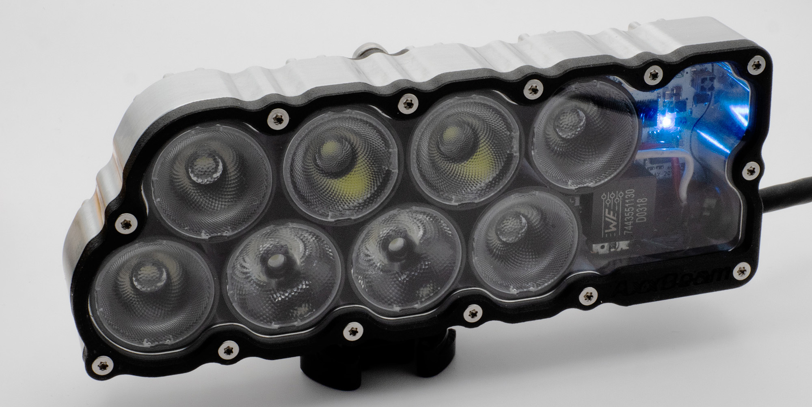
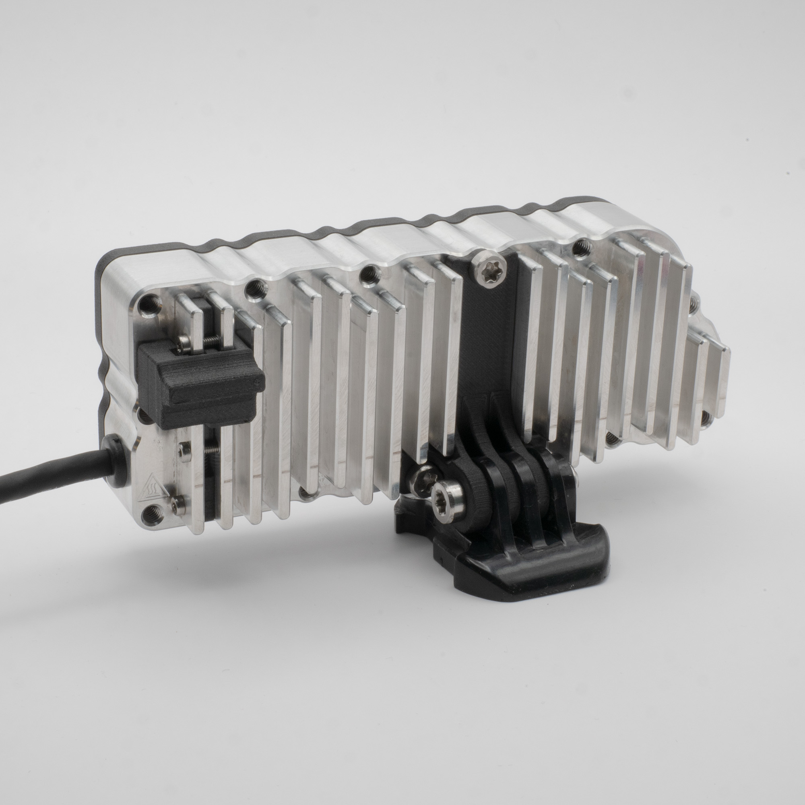
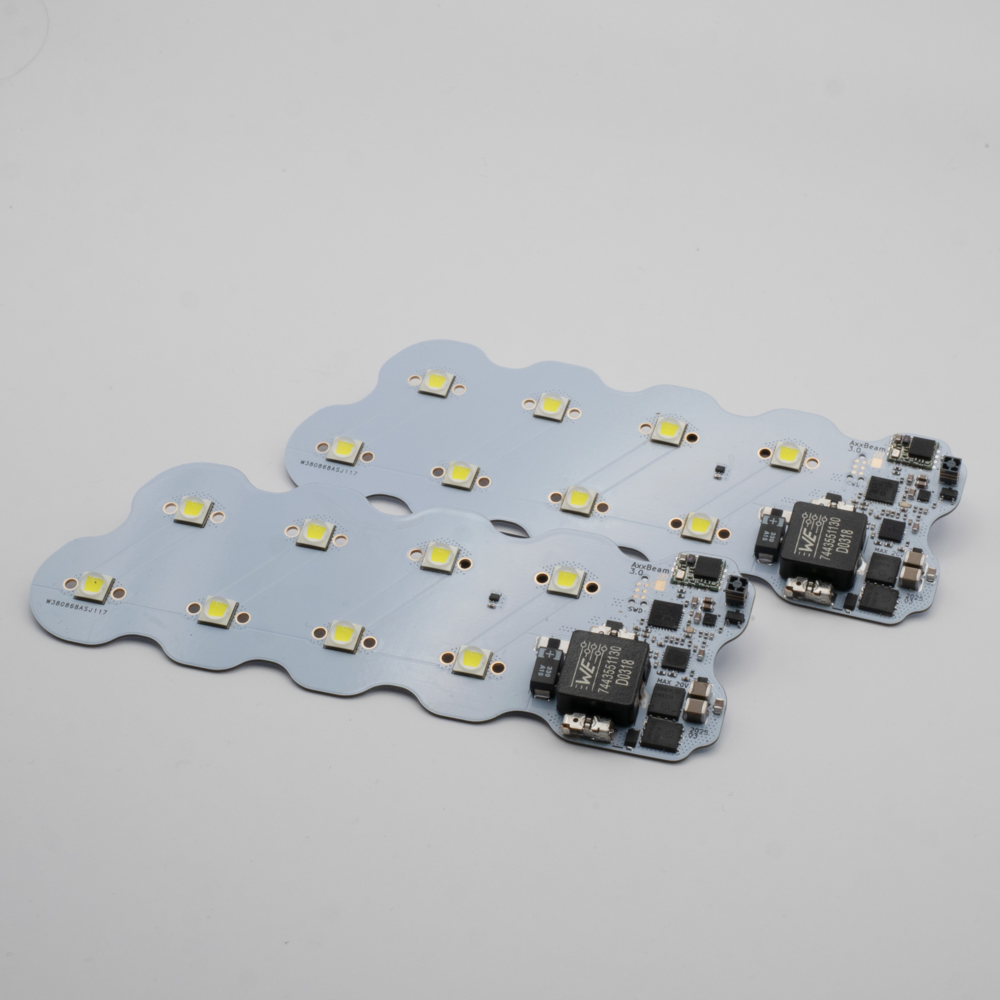
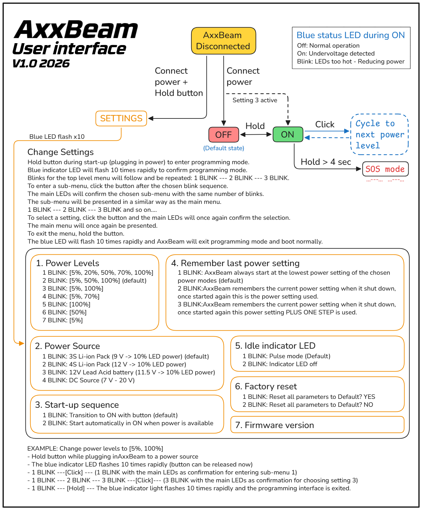
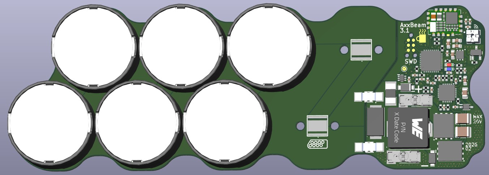
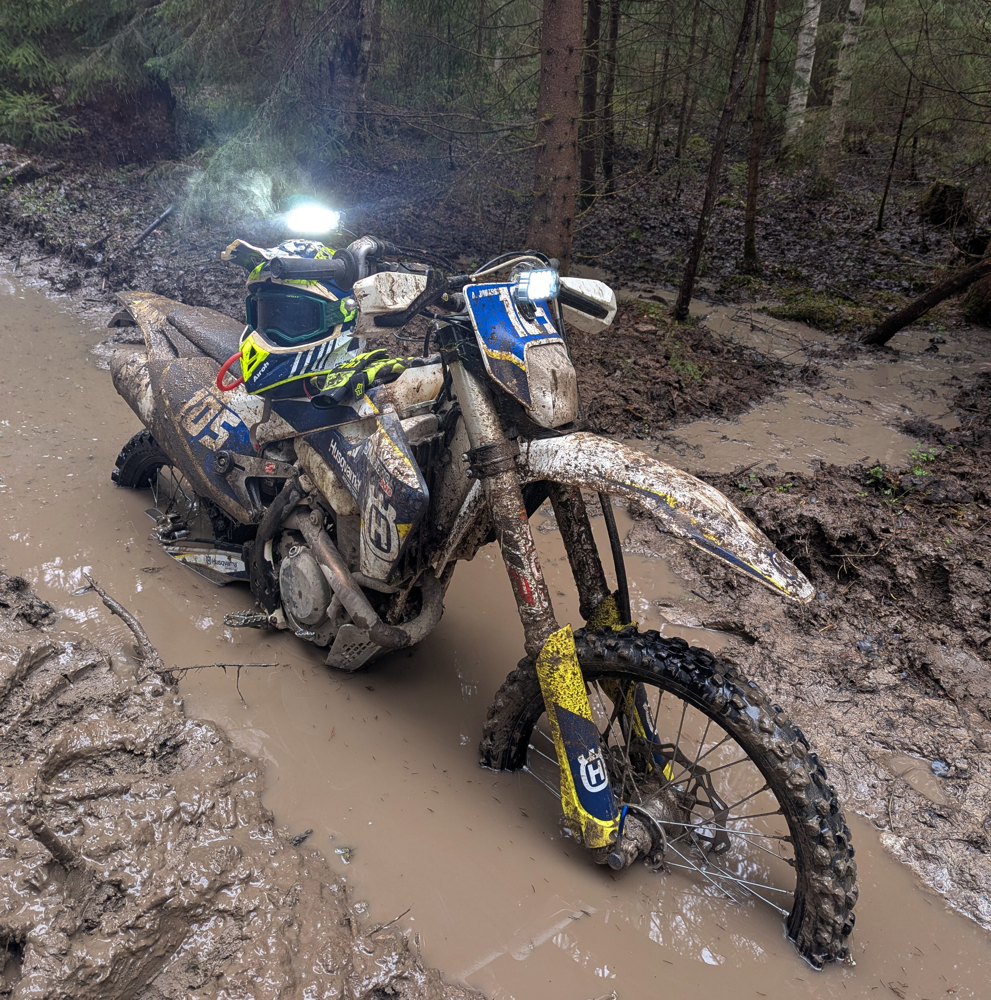

# AxxBeam

AxxBeam is a **high-power headlamp**, designed with durability and thermal performance as the main priorities.  
It is built to survive harsh environments while giving the most usable light possible.

The project started out of frustration with existing commercial solutions: high price, questionable design choices, and optimistic specifications. AxxBeam is my attempt to do it properly, from PCB and firmware to mechanics and thermal design.  

---

## Intended use

AxxBeam is primarily **optimized for helmet mounting**, either as a single unit or as a pair, but it can also be mounted in auxiliary positions or other applications thanks to a flexible mounting system.

The light is designed for continuous high output with active thermal and power management to protect both the LEDs and the power source.

---

## Connectivity & firmware

AxxBeam includes a built-in **Bluetooth/LTE module** used for:
- Wireless firmware updates  
- Configuration and diagnostics  
- Communication with an Android app for control and status monitoring  
- Enabling future features, such as a wireless handlebar switch  

---

## Power & safety behavior

AxxBeam continuously monitors input voltage and system load.  
When the battery voltage drops close to its lower limit, the lamp will **automatically reduce output** instead of shutting off abruptly. This prioritizes runtime and helps ensure you still have light to get home.

This behavior is fully handled in firmware and requires no user interaction.

---

## Design highlights

- **High-output LED system** latest version CREE XM-L2 diodes paired with optics from LEDiL 
- **Split-board design** with LEDs mounted on an aluminium MCPCB for efficient heat transfer  
- **Full CNC-machined aluminium body**, acting as both a tough enclosure and heatsink  
- **Magnetic switch** to reduce water ingress points  
- **Modular mounting system**, primarily GoPro-compatible  
- **M4 threaded holes on the backside** for flexible and custom mounting solutions  
- **3 mm thick polycarbonate front glass**, sealed with a silicone O-ring  
  - Glass is replaceable if damaged  
- **Wide input voltage range**, suitable for common off-road power systems  
- **Active temperature regulation**  
  - Output is smoothly reduced at thermal limits to prevent overheating  
- Designed for serviceability and long-term use rather than sealed-forever construction  

---

## Specifications

- **Weight:** 210 g  
- **Input voltage:** 7–20 V  
- **Electrical power:** up to 90 W  
  - (e.g. ~7.5 A at 12 V)  
- **Light output:**  
  - ~10 000 lm in turbo mode *(estimate — to be measured)*  
  - Turbo mode requires constant movement for cooling  
- **LEDs:** 8 × Cree XM-L2  
- **Front glass:** 3 mm polycarbonate  
- **Cable:**  
  - 500 mm length  
  - 4.7 mm diameter  
  - Anderson PowerPole 45 connector  
- **Mount:**  
  - GoPro-style mount  
  - Additional M4 mounting points on rear side  
- **Light levels:**  
  - 5 %, 50 %, 100 % *(configurable)*  
- **Thermal management:**  
  - Active temperature monitoring with smooth output control at max temperature  
- **Low-voltage behavior:**  
  - Automatic output reduction to extend remaining runtime  

---

