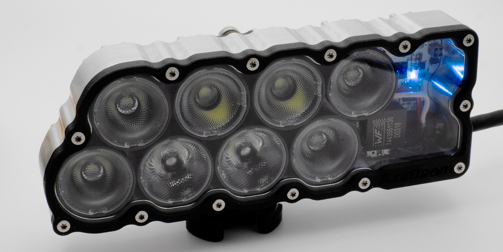
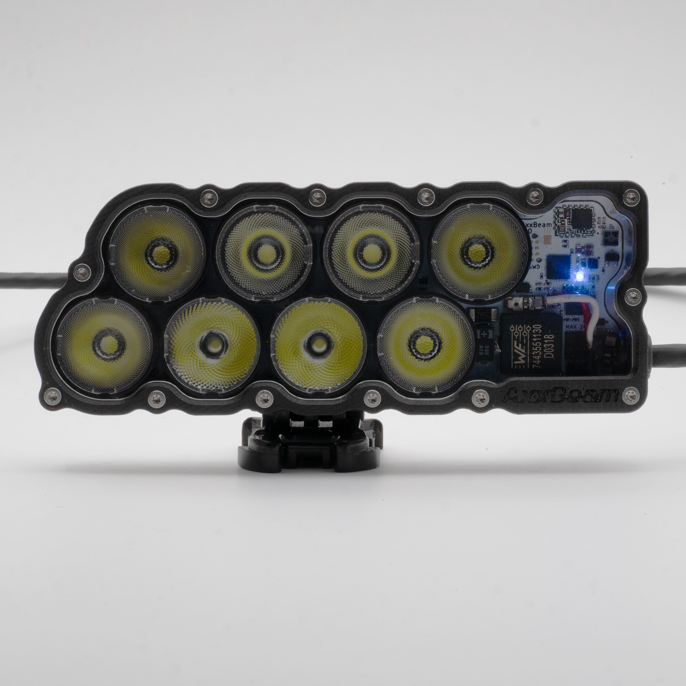
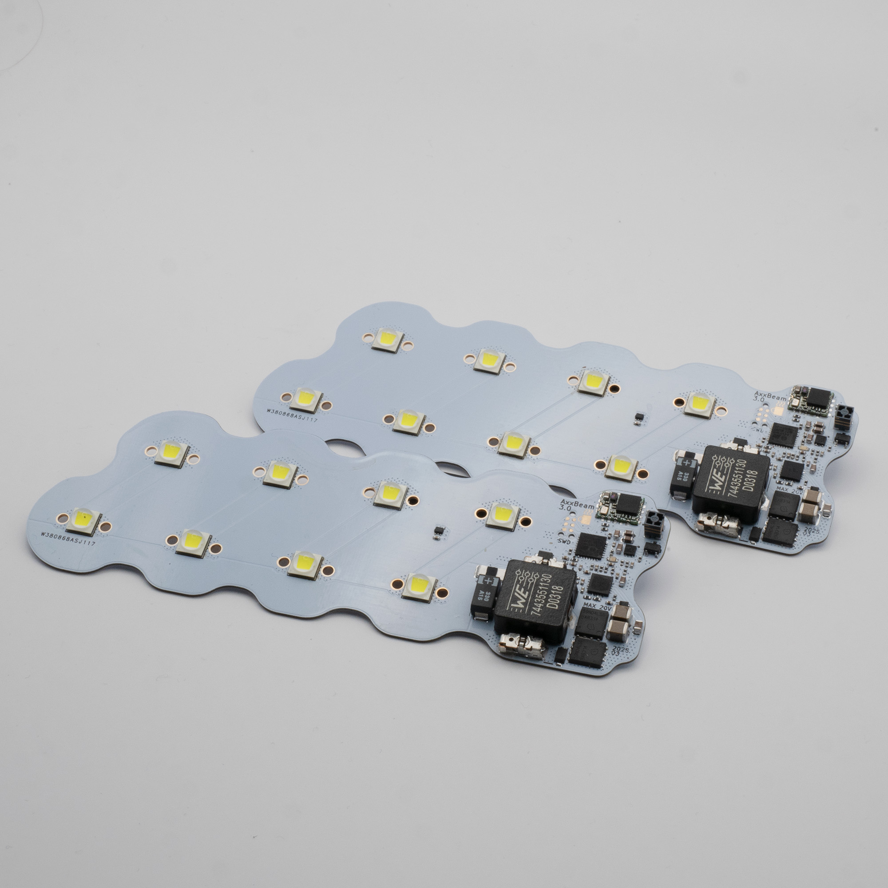
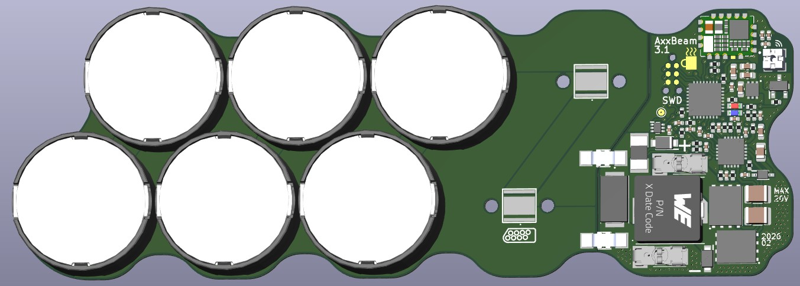
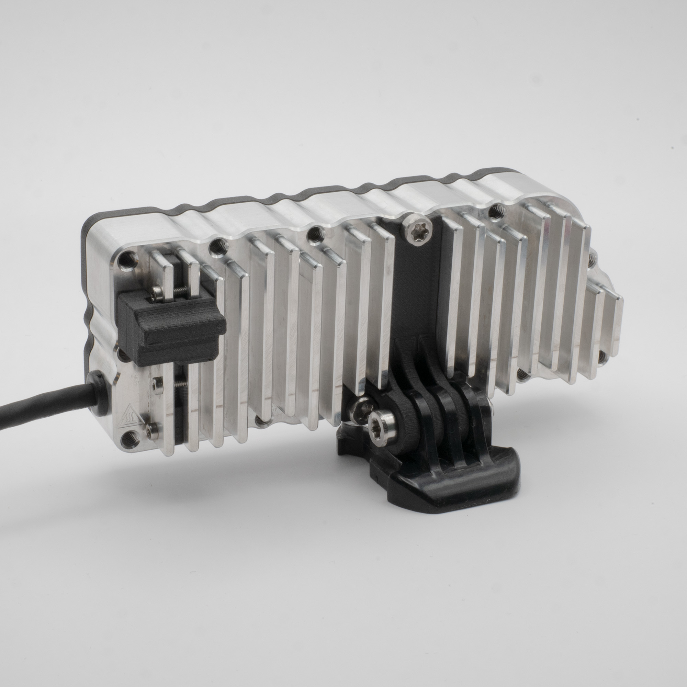
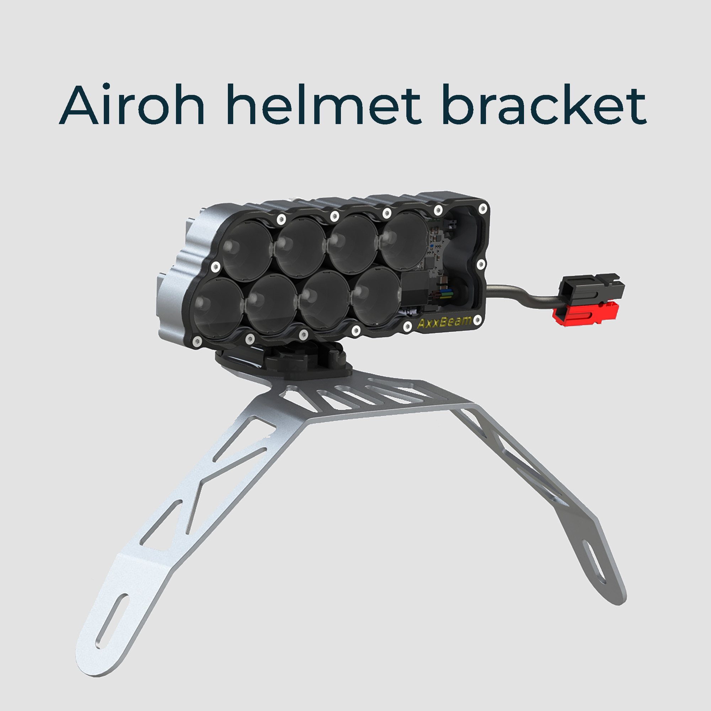
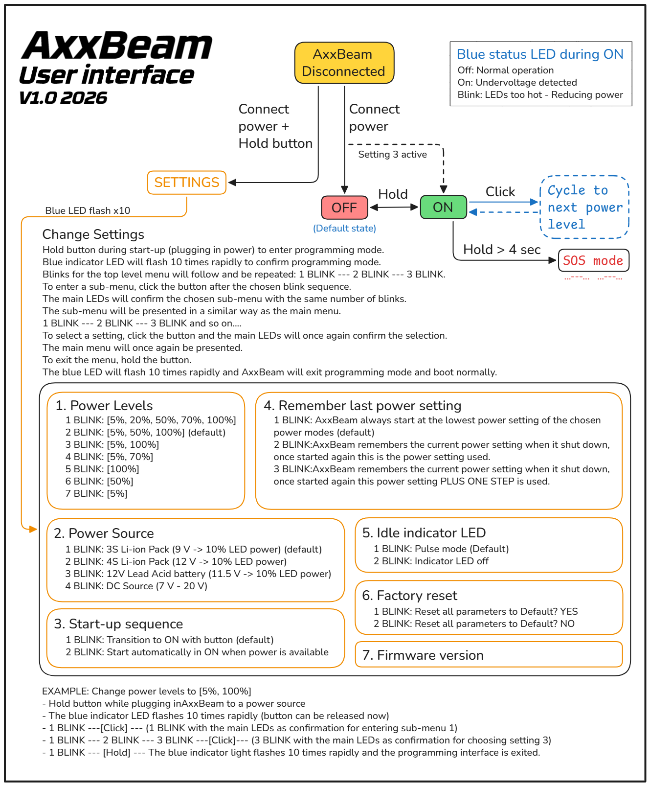

# AxxBeam Overview
AxxBeam is a STM32 based high-power enduro headlamp designed with durability and thermal performance as the main priorities. It is built to survive harsh environments while delivering the most usable light possible.  
The project started out of frustration with existing commercial solutions: high price, questionable design choices, and optimistic specifications. AxxBeam is my attempt to do it properly -- from PCB and firmware to mechanics and thermal design.  
The hardware is built around the [STM32G431KBU6](https://www.st.com/en/microcontrollers-microprocessors/stm32g431kb.html) microcontroller, driving 8x [Cree XM-L2](https://www.cree-led.com/products/xlamp-leds-arrays/xlamp-xm-l2) LEDs through an [LT3741](https://www.analog.com/en/products/lt3741.html) LED driver. The light features a full CNC-machined aluminium body, a magnetic Hall-effect switch, active temperature regulation, and a built-in [RN4871](https://www.microchip.com/en-us/product/rn4871) Bluetooth module for wireless firmware updates and Android app control.    

# Table of Contents
- [AxxBeam Overview](#axxbeam-overview)
- [Features](#features)
- [Specifications](#specifications)
- [Photometric Test Results](#photometric-test-results)
- [PCB](#pcb)
- [Mechanical Design & Mounting](#mechanical-design--mounting)
- [Firmware](#firmware)
- [Programming Interface (Settings Menu)](#programming-interface-settings-menu)
- [Power & Thermal Management](#power--thermal-management)
- [Bluetooth Connectivity](#bluetooth-connectivity)
- [SOS Mode](#sos-mode)
- [Firmware Update](#firmware-update)
- [Disclaimer](#disclaimer)

# Features
- **8,332 lumens** measured at full power with 46,271 cd peak intensity and ~430 m throw (tested by OliNo Labs).
- **8x Cree XM-L2 LEDs** paired with LEDiL optics, mounted on a separate aluminium MCPCB for efficient heat transfer.
- **Full CNC-machined aluminium body** acting as both enclosure and heatsink.
- **Magnetic Hall-effect switch** -- no mechanical button, reducing water ingress points.
- **Active temperature regulation** -- smoothly reduces output at thermal limits to protect LEDs and optics.
- **Low-voltage protection** -- automatically reduces output as battery depletes instead of shutting off abruptly.
- **Configurable power modes** via a blink-based programming interface. All settings stored in non-volatile flash.
- **Multiple power source profiles** -- 3S Li-ion, 4S Li-ion, 12V Lead Acid, or DC source (7-20V).
- **SOS morse code mode** -- activated by a 4-second long press during operation.
- **Bluetooth module** (Microchip RN4871) for wireless firmware updates and Android app control.
- **3 mm polycarbonate front glass**, sealed with O-ring, replaceable if damaged.
- **Modular mounting** -- GoPro-compatible quick release + M4 threaded holes on rear side.
- Designed for serviceability and long-term use.

# Specifications
| Parameter | Value |
|-----------|-------|
| **Weight** | 210 g |
| **Input voltage** | 7-20 V |
| **Electrical power** | up to 90 W (~7.5 A at 12 V) |
| **Luminous flux** | 8,332 lm (measured) |
| **Peak intensity** | 46,271 cd |
| **Beam angle** | ~20 degrees (to 50% peak) |
| **Field angle** | ~42 degrees (to 10% peak) |
| **Estimated throw** | ~430 m (ANSI FL1) |
| **LEDs** | 8x Cree XM-L2 (XMLBWT-00-0000-0000U3051) |
| **LED driver** | Linear Technology LT3741 |
| **MCU** | STM32G431KBU6 (ARM Cortex-M4) |
| **Temperature sensor** | TMP1075 (I2C) |
| **Bluetooth** | Microchip RN4871 |
| **Front glass** | 3 mm polycarbonate |
| **Cable** | 500 mm, 4.7 mm diameter, Anderson PowerPole 45 connector |
| **Mount** | GoPro-style + M4 threaded holes |
| **Light levels** | 5%, 50%, 100% (configurable) |
| **Firmware version** | 4.0 |

# Photometric Test Results
AxxBeam has been independently tested by [OliNo Labs](https://www.olino.org) (test number 20260304.001, issued 2026-04-03). The photometric data is available in both [IES](./other/Axel-Axxbeam.IES) and [EULUMDAT/LDT](./other/Axel-Axxbeam_eulumdat.ldt) formats.

## IES results
| Parameter | Value |
|-----------|-------|
| **Test laboratory** | OliNo Labs |
| **Lamp voltage / current** | 17.6 V / 5.83 A (102.6 W) |
| **Total luminous flux** | 8,332 lm |
| **Peak intensity (on-axis)** | 46,271 cd |
| **Luminous efficacy** | ~81 lm/W |
| **Beam angle (50% peak)** | ~20 degrees |
| **Field angle (10% peak)** | ~42 degrees |
| **ANSI FL1 throw** | ~430 m |

## EULUMDAT results
The EULUMDAT measurement accounts for optical losses through the luminaire assembly (reflector, lens system).

| Parameter | Value |
|-----------|-------|
| **Luminaire luminous flux** | 5,018 lm |
| **Luminaire efficiency (LOR)** | ~60% |
| **Peak intensity (on-axis)** | 5,560 cd |
| **Beam angle (50% peak)** | ~88 degrees |
| **Field angle (10% peak)** | ~113 degrees |

# PCB
The PCBs are designed in KiCad. AxxBeam uses a **split-board design**: the driver PCB carries the STM32G431KBU6 MCU, LT3741 LED driver, RN4871 Bluetooth module, power regulation, and all control electronics. The LED PCB is a separate aluminium-core MCPCB carrying the 8x XM-L2 LEDs, allowing efficient thermal transfer directly into the CNC housing/heatsink.

Gerber files are available under [/fabrication](./AxxBeam_hardware/fabrication) with separate ZIP archives for the driver PCB and LED PCB. An interactive BOM viewer is available at [/bom/ibom.html](./AxxBeam_hardware/bom/ibom.html).

# Mechanical Design & Mounting
The body is fully CNC-machined from aluminium (3-op program for Syil T3 mill), serving as both enclosure and heatsink. The front glass is 3 mm polycarbonate sealed with an O-ring, replaceable if damaged. CNC polycarbonate lenses are machined to fit the LED array. 3D-printed bezel and GoPro mount are available as STEP files under [/Manufacturing_3Dprint](./Manufacturing_3Dprint). CAD files are in SolidWorks format under [/CAD](./CAD).

AxxBeam is primarily optimized for **helmet mounting**, either as a single unit or as a pair:
- **GoPro-style quick-release mount** for fast attachment and removal.
- **M4 threaded holes on the rear side** for custom mounting.
- **Dedicated helmet bracket** in both CNC sheet metal and 3D-printed versions, single and dual-lamp configurations.

# Firmware
The firmware is written in C for the STM32G431KBU6 using STM32CubeIDE and the STM32 HAL library. It implements an IDLE/RUN state machine with smooth DAC-controlled power transitions, continuous temperature monitoring (TMP1075 via I2C) with proportional output reduction above 75 deg C, ADC-based battery voltage monitoring, Hall-effect button handling with debounce, and RN4871 Bluetooth communication for app control and OTA updates. All user settings are stored in internal flash.

# Programming Interface (Settings Menu)
AxxBeam uses a **blink-based programming interface** operated with a single magnetic switch. All settings are stored in non-volatile flash memory.

## How to enter settings
1. Hold the button while plugging in power to enter programming mode.
2. The blue indicator LED will flash **10 times** rapidly to confirm entry.
3. The main menu blink sequence starts: `1 BLINK ---(delay)--- 2 BLINK ---(delay)--- 3 BLINK ...`
4. **Short press** the button after the desired blink count to enter that sub-menu.
5. The main LEDs will confirm the selection with the same number of blinks.
6. The sub-menu is presented the same way -- short press to select.
7. **Long press** the button at any time to save settings and exit programming mode.
8. The blue indicator flashes 10 times rapidly to confirm exit.

## Menu structure

### 1 BLINK -- Power Modes
Configure which power levels are available during normal operation. Short press the button during RUN mode to cycle through the selected levels.

| Sub-menu | Power levels | Default |
|----------|-------------|---------|
| 1 BLINK | 5%, 20%, 50%, 70%, 100% | |
| **2 BLINK** | **5%, 50%, 100%** | **Yes** |
| 3 BLINK | 5%, 100% | |
| 4 BLINK | 5%, 70% | |
| 5 BLINK | 100% | |
| 6 BLINK | 50% | |
| 7 BLINK | 5% | |

### 2 BLINK -- Power Source
Select the battery/power source type. The lamp will automatically dim at the end of the battery capacity based on the selected profile.

| Sub-menu | Source | Low-voltage threshold | Default |
|----------|--------|----------------------|---------|
| **1 BLINK** | **3S Li-ion Pack** | **9.0 V** | **Yes** |
| 2 BLINK | 4S Li-ion Pack | 12.0 V | |
| 3 BLINK | 12V Lead Acid | 11.5 V | |
| 4 BLINK | DC Source (7-20V) | 7.1 V | |

### 3 BLINK -- Start-up Sequence
| Sub-menu | Behavior | Default |
|----------|----------|---------|
| **1 BLINK** | **Start LEDs with button press** | **Yes** |
| 2 BLINK | Start automatically when power is available | |

### 4 BLINK -- Remember Last Power Setting
| Sub-menu | Behavior | Default |
|----------|----------|---------|
| **1 BLINK** | **Always start at lowest power level** | **Yes** |
| 2 BLINK | Remember the last used power level | |
| 3 BLINK | Remember last power level + one step up | |

### 5 BLINK -- Idle Indicator LED
| Sub-menu | Mode | Default |
|----------|------|---------|
| **1 BLINK** | **Pulse** | **Yes** |
| 2 BLINK | Breath | |
| 3 BLINK | Off | |

### 6 BLINK -- Factory Reset
| Sub-menu | Action |
|----------|--------|
| 1 BLINK | Reset all parameters to defaults -- YES |
| 2 BLINK | Reset all parameters to defaults -- NO |

### 7 BLINK -- Version Info
Selecting this menu blinks the firmware major and minor version numbers via the status LED.

## Example: Changing to 12V Lead Acid battery
1. Hold button while plugging in power
2. Blue LED flashes 10 times (release button)
3. Wait for: `1 BLINK --- 2 BLINK ---` then **short press** (enters Power Source menu)
4. Main LEDs confirm with 2 blinks
5. Wait for: `1 BLINK --- 2 BLINK --- 3 BLINK ---` then **short press** (selects 12V Lead Acid)
6. Main LEDs confirm with 3 blinks
7. **Long press** to save and exit

# Power & Thermal Management
AxxBeam continuously monitors PCB temperature and input voltage. When the temperature exceeds 75 deg C, LED power is proportionally reduced -- a smooth curve rather than a hard cutoff. The blue status LED turns solid to indicate thermal limiting.

When the battery voltage drops below the configured threshold, power is gradually reduced to extend runtime while keeping a minimum of 5% output. If the bus voltage drops below 7V, the lamp latches off until voltage recovers above 7.5V. During low-voltage limiting, the status LED blinks to alert the rider.

# Bluetooth Connectivity
AxxBeam includes a Microchip **RN4871** BLE module connected via UART at 115200 baud. It supports wireless firmware updates (`__OTA__` command triggers DFU mode), remote button control (`__LONGPRESS__`, `__SHORTPRESS__`), version query (`__VERSION__`), and live telemetry broadcast every 500 ms. An Android app is available for control and status monitoring.

# SOS Mode
During normal RUN operation, holding the button for **4 seconds** activates SOS mode. The main LEDs will flash the international Morse code distress signal ( `...---...` ) at 90% power, repeating continuously. A short press exits SOS mode and returns to normal RUN operation. A long press turns the lamp off.

# Firmware Update
Flashing or updating the firmware on the STM32 MCU can be done in two ways:

## SWD programmer
1. Download the latest `AxxBeam.bin` from Releases.
2. Connect an SWD programmer (e.g. STLINK-V3MINIE) to the TC2030 header with GND, 3.3V, NRST, SWCLK and SWDIO.
3. Use [STM32CubeProgrammer](https://www.st.com/en/development-tools/stm32cubeprog.html) to flash the binary.

## Wireless (BLE OTA)
1. Connect to AxxBeam via the Android app or a BLE terminal.
2. Send the `__OTA__` command. The MCU will enter the STM32 internal bootloader (DFU mode).
3. Flash the firmware via USB DFU using STM32CubeProgrammer.

# Disclaimer
AxxBeam is an open source project and has absolutely no warranty, or guarantees on functionality or reliability! The author of this project accepts absolutely no liability for any harm or loss resulting from its use. That said, have fun. :)
