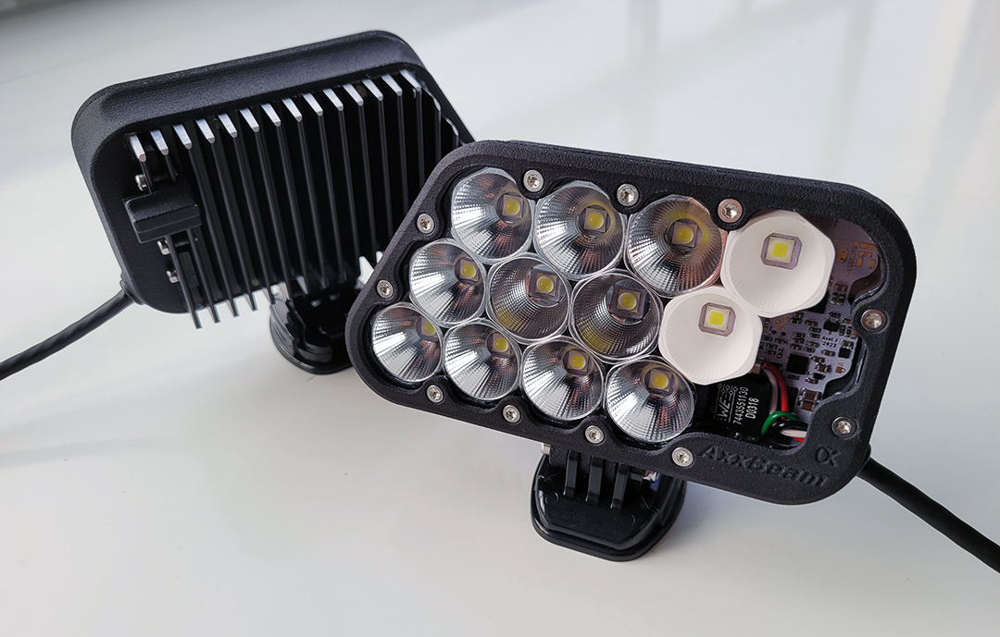
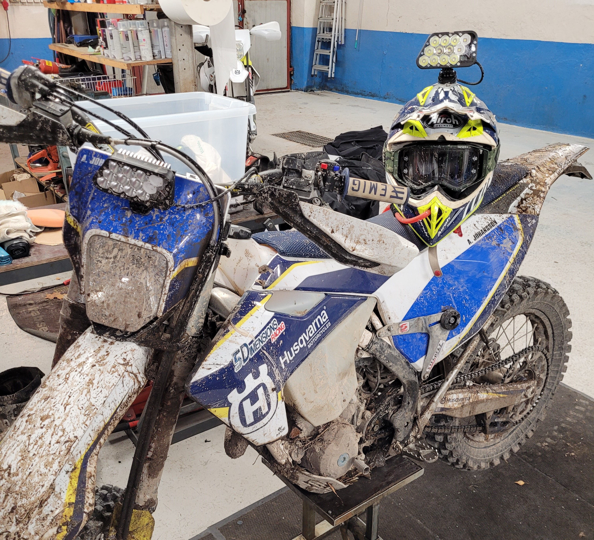

__+-----------------------------------+|   AxxBeam Specifications          |+-----------------------------------+__  
__Weight:__ 240 g  
__Input voltage:__ 7-20 V  
__Electrical Power:__ 90 W (e.g 7,5 A at 12 V)  
__Light flux:__ 9750 lm (based on estimations from datasheet and comparision to LedX Cobra which has a electric power of 60W with 8 CREE XM-L2 diodes and producing 6500 lm)  
__LEDs:__ 12 CREE XM-L2  
__Glass:__ 3 mm thick Polycarbonate  
__Cord:__ 500 mm long, 4.7 mm diameter with Andersson PowerPole 15 connector.  
__Mount:__ GoPro mount  
__Light intensities:__ 5%, 50%, 100% (Configurable)  
__Temperature regulation:__ At max temperature the lamp will dim down in order to not over heat.  

__+-----------------------------------+|   AxxBeam Programming Interface   |+-----------------------------------+__  
Settings done with this programming interface will be written to non-volatile flash memory.

Hold button during start-up (plugging in power) to enter programming mode.  
Blue indicator light will flash 10 times rapidly to confirm programming mode.  
Blinks for the top level menu will follow and be repeated: 1 BLINK ---(delay)--- 2 BLINK ---(delay)--- 3 BLINK.  
To enter a sub-menu, short press the button after the chosen blink sequence.  
The main LEDs will confirm the chosen sub-menu with the same number of blinks.  
The sub-menu will be presented in a similar way as the main menu.  
1 BLINK ---(delay)--- 2 BLINK ---(delay)--- 3 BLINK and so on....  
To select a setting, short press the button and the main LEDs will once again confirm the selection.  
The main menu will once again be presented.  
To exit the menu, long press the button.  
The blue indication light will flash 10 times rapidly and the lamp will exit programming mode and boot up as normal.  

__EXAMPLE: To change power modes to [5%, 100%]__  
	- Hold button while plugging in the lamp to a power source  
	- The blue indicator light flashes 10 times rapidly (button can be released now)  
	- 1 BLINK ---(short button press) --- (1 BLINK with the main LEDs as confirmation for entering sub-menu 1)  
	- 1 BLINK --- 2 BLINK --- 3 BLINK ---(short button press)--- (3 BLINK with the main LEDs as confirmation for choosing setting 3)  
	- 1 BLINK --- (long button press) --- The blue indicator light flashes 10 times rapidly and the programming interface is exited.  

- Top level menu  
	- Sub-menu  

- 1 BLINK (Power modes)  
	- 1 BLINK: Power modes -> [5%, 20%, 50%, 70%, 100%]  
	- 2 BLINK: Power modes -> [5%, 50%, 100%] (default)  
	- 3 BLINK: Power modes -> [5%, 100%]  
	- 4 BLINK: Power modes -> [5%, 70%]  
	- 5 BLINK: Power modes -> [100%]  
	- 6 BLINK: Power modes -> [50%]  
	- 7 BLINK: Power modes -> [5%]  

- 2 BLINK (Power source, The LEDs will dim down at the end of the battery capacity)  
	- 1 BLINK: 3S Li-ion Pack (9 V -> 10% lED power) (default)  
	- 2 BLINK: 4S Li-ion Pack (12 V -> 10% lED power)  
	- 3 BLINK: 12V Lead Acid battery (11.5 V -> 10% lED power)  
	- 4 BLINK: DC Source (7 V - 20 V)  

- 3 BLINK (Start-up sequence)  
	- 1 BLINK: Start LEDs with button (default)  
	- 2 BLINK: Start Automatically when power is available  

- 4 BLINK (Remember last power setting)  
	- 1 BLINK: The lamp always start at the lowest power setting of the chosen power modes (default)  
	- 2 BLINK: The lamp remembers the current power setting when it shut down, once started again this is the power setting used.  
	- 3 BLINK: The lamp remembers the current power setting when it shut down, once started again this power setting PLUS ONE STEP is used.  

- 5 BLINK (Idle indicator LED)  
	- 1 BLINK: Pulse mode (Default)  
	- 2 BLINK: Breath mode  
	- 3 BLINK: Indicator LED off  

- 6 BLINK (Factory reset)  
	- 1 BLINK: Reset all parameters to Default?  YES  
	- 2 BLINK: Reset all parameters to Default?  NO  

- 7 BLINK (Version info)  
